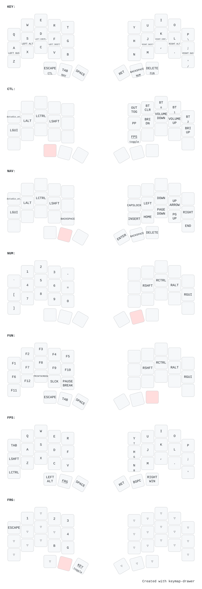

# Custom temper Config
A custom config for the [temper](https://github.com/raeedcho/temper) by raeedcho.
## Modules Used
- [oled_adapter](https://github.com/mctechnology17/zmk-oled-adapter) by mctechnology17 
- [nice_oled](https://github.com/mctechnology17/zmk-nice-oled) by mctechnology17
## Features
- ZMK Studio Support
- Custom Case
- OLED Support
## Custom Case (not finalized)
My [custom designed case](case/readme.md) built to fit my 350mah batteries along with a built-in tilt. If you wan't to know if your batteries can fit, I built mine for a `40mm x 20mm x 6mm +-2mm` [battery](https://shopee.ph/602040-Rechargeable-Battery-3.7v-Li-Ion-Po-Lithium-Polymer-Batteries-For-Voice-Recorder-speaker-i.561651.24615851427?xptdk=ac1c8929-03fb-49db-abe4-c38d420622f7).

It also comes with 2 versions for the top plate, one with a dedicated switch, and one with a cutout on the type-c port for any clearance issues.

I haven't tested the one with a switch yet since I don't have a printer ready, but I'll update this repo once I do.

*images to be added...*
## Keymap
Generated using **caksoylar's** [keymap-drawer](https://github.com/caksoylar/keymap-drawer)
